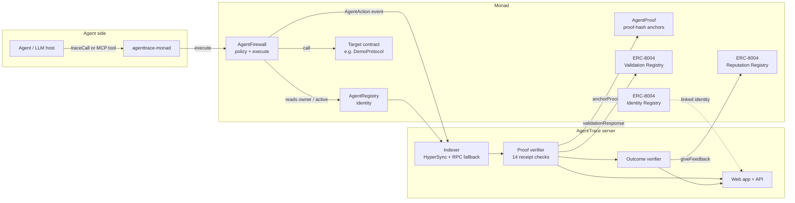
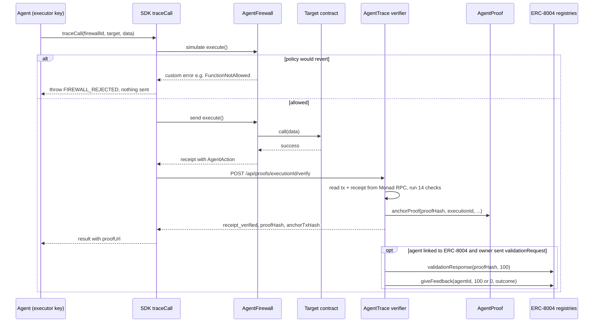
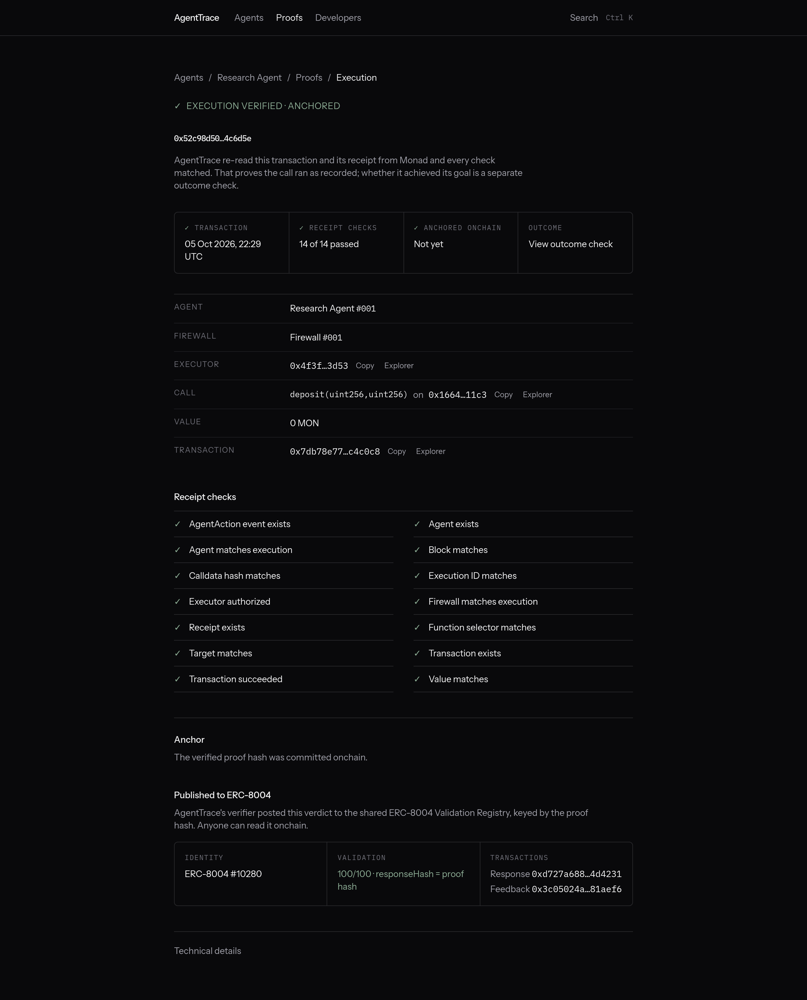
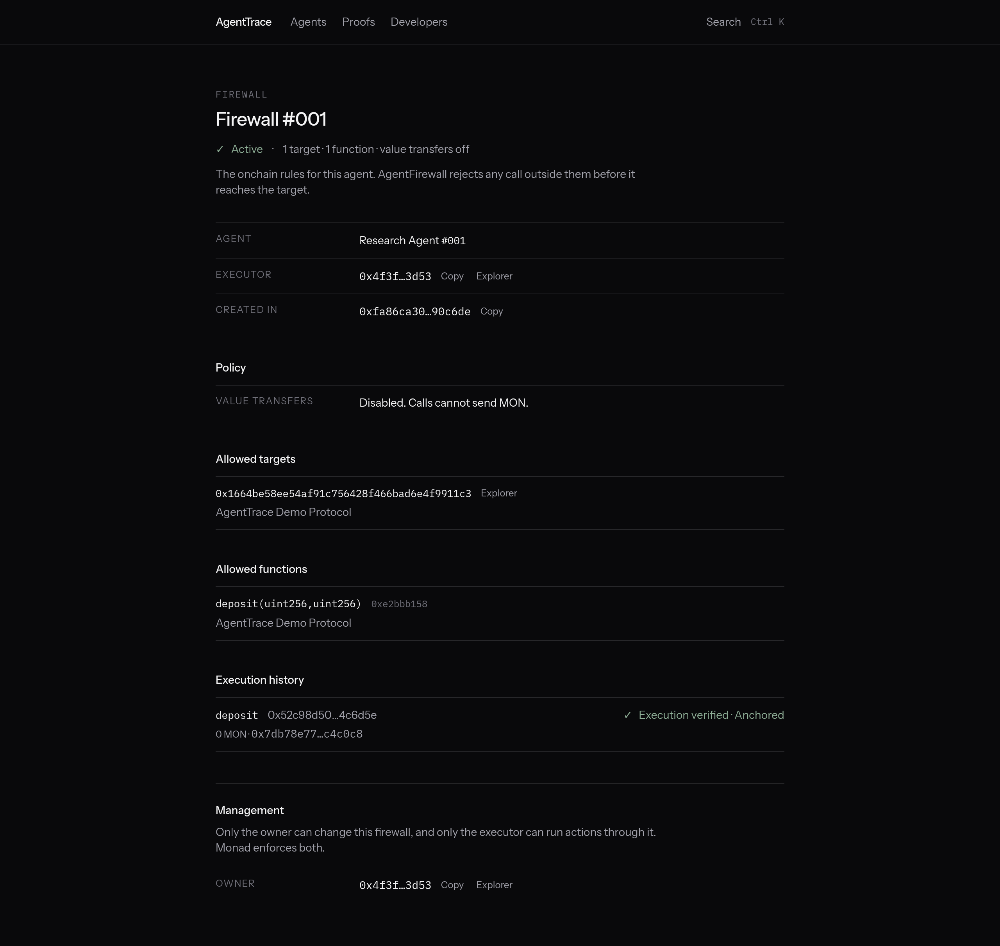
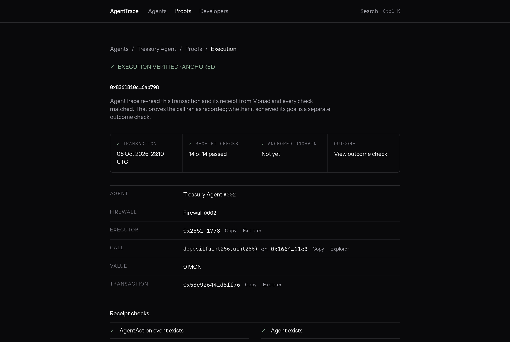
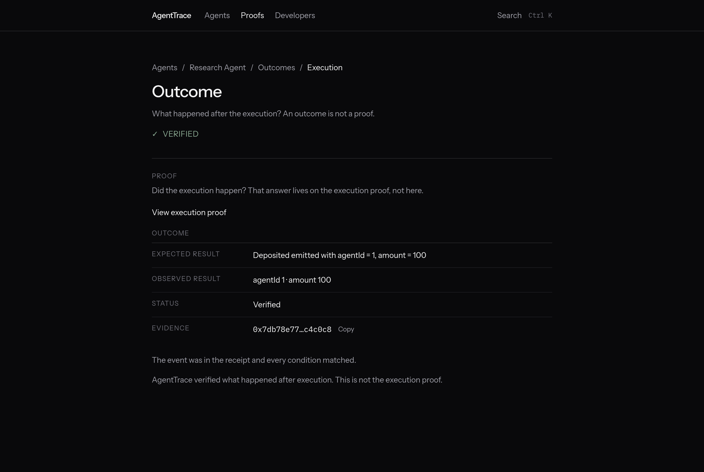

# AgentTrace

**Every agent leaves a trace.** An independent validator and audit trail for onchain AI agents on Monad, publishing its verdicts to the official ERC-8004 registries.

> Monad Metropolis · Track 04: Trust, Identity & AI

An agent holding a wallet can call anything, and afterwards nobody can easily say *which* agent acted, *what it was allowed to do*, *what actually ran*, or *whether it worked*. AgentTrace turns each agent call into four separate, checkable facts: an onchain **identity** (`AgentRegistry`), an onchain **permission firewall** that is the only path for the call (`AgentFirewall`), a **receipt-verified execution proof** whose hash is anchored onchain (`AgentProof`), and a separate **outcome verdict**. Proof and outcome verdicts are then written to the canonical **ERC-8004 Validation and Reputation registries** on Monad, so any wallet, marketplace, or other agent can read them without trusting this app. It runs live on Monad mainnet and testnet, and plugs into existing agents through a one-function SDK (`traceCall`) or an MCP server.

| | |
| --- | --- |
| Live app, mainnet (chain 143) | https://agenttrace-mainnet.vercel.app |
| Live app, testnet (chain 10143) | https://agenttrace-plum.vercel.app |
| Short demo video (about 90 s, opens with a blocked call) | [docs/demo-short.mp4](docs/demo-short.mp4) |
| Full demo video (narrated, about 2 min 50 s, recorded on mainnet) | [docs/demo.mp4](docs/demo.mp4) |
| Submission notes | [docs/submission.md](docs/submission.md) |
| Judge quick check (5 minutes) | [below](#judge-quick-check) |

## Contents

- [The problem](#the-problem)
- [How it works](#how-it-works)
- [Architecture](#architecture)
- [Contracts](#contracts)
- [ERC-8004 integration](#erc-8004-integration)
- [SDK: `traceCall`](#sdk-tracecall)
- [MCP firewall server](#mcp-firewall-server-mainnet)
- [Amount limits](#amount-limits-argument-caps)
- [Recompute a proof yourself](#recompute-a-proof-yourself)
- [HTTP API](#http-api)
- [Indexing with Envio HyperSync](#indexing-with-envio-hypersync)
- [Security model and trust assumptions](#security-model-and-trust-assumptions)
- [Limitations](#limitations)
- [Why Monad](#why-monad)
- [Run it locally](#run-it-locally)
- [Repository structure](#repository-structure)
- [Judge quick check](#judge-quick-check)
- [Demo video and screenshots](#demo-video-and-screenshots)
- [Roadmap](#roadmap)

## The problem

Agents increasingly hold keys and act onchain. A raw transaction from an agent wallet does not say:

1. **Who** acted. A bare EOA is not a stable, owned agent identity.
2. **What was allowed.** Off-chain prompt rules or app-side checks can be bypassed by anything that holds the key.
3. **What actually executed.** A UI or the agent's own log is not evidence; the chain receipt is.
4. **Whether the intended result happened.** A successful transaction is not the same thing as a successful outcome.

These four are usually blurred together. AgentTrace keeps them apart and makes each one checkable by a third party.

## How it works

1. **Register.** The owner calls `AgentRegistry.registerAgent`. The agent gets a persistent id (ids are never reused; deactivation keeps history).
2. **Fence.** The owner calls `AgentFirewall.createFirewall` with an executor key, then allows specific targets and 4-byte function selectors, and optionally a value policy (per-transaction and per-period limits). Everything is default-deny.
3. **Execute.** The agent's executor calls `AgentFirewall.execute(firewallId, target, value, data)`. The contract checks agent active, firewall active and unpaused, executor, target, selector, calldata length, and value policy, then calls the target. If the target reverts, the whole transaction reverts. `AgentAction` is emitted only after success.
4. **Index.** The indexer reads registry, firewall, and proof logs (Envio HyperSync when configured, public RPC otherwise).
5. **Prove.** The verifier reads the Monad transaction and receipt itself and runs 14 checks (transaction exists, receipt succeeded, called the configured firewall, `AgentAction` present, agent/firewall/executor/target/selector/execution id/block/value/calldata hash all match). Only if every check passes is the proof `receipt_verified`, with a deterministic proof hash (`keccak256(abi.encode(...))`, see [docs/contracts.md](docs/contracts.md#proof-hash)).
6. **Anchor.** The verifier wallet writes the proof hash to `AgentProof.anchorProof`. Anchors are append-only and cannot be repeated.
7. **Outcome.** Separately, an expectation (for example "`Deposited` with amount 100") is checked against the receipt logs, or against Demo Protocol state that this transaction changed. Unsupported checks are `unverifiable`, never "verified".
8. **Publish.** If the agent is linked to an ERC-8004 identity, the verifier answers the owner's `validationRequest` with `validationResponse(…, 100, …)` and posts `giveFeedback` (100 if the outcome verified, 0 if it failed) to the Reputation Registry.

## Architecture





More detail: [docs/architecture.md](docs/architecture.md).

## Contracts

Solidity 0.8.31, no proxy, no `delegatecall`, no `tx.origin`, custom errors. Same addresses on both networks (same deployer, same nonces 0–3).

### Monad mainnet (chain 143), deployed 5 October 2026

| Contract | Address (Monad mainnet, 143) | Deploy block | Deploy tx |
| --- | --- | --- | --- |
| AgentRegistry | [`0xfa66d202dae4b7fb9aa5c6ee80390ca8bb48739e`](https://monadvision.com/address/0xfa66d202dae4b7fb9aa5c6ee80390ca8bb48739e) | 110869327 | [`0x65bf8edd…`](https://monadvision.com/tx/0x65bf8edd7aefa5805afae5984e94f6f0e65315a9fc9f152b3e25900d4a395255) |
| AgentFirewall | [`0x694178a2396b54bff6a25caa0aa9cca6eb079441`](https://monadvision.com/address/0x694178a2396b54bff6a25caa0aa9cca6eb079441) | 110869330 | [`0xd1c07b28…`](https://monadvision.com/tx/0xd1c07b28ad4c7e937bc2d5f78124cb14cefe4ac3c0f22ffea3f131c9663e308f) |
| AgentProof | [`0x3ea5602072d6028f569f45ea164d5cbe36cbbd3e`](https://monadvision.com/address/0x3ea5602072d6028f569f45ea164d5cbe36cbbd3e) | 110869333 | [`0xa347bfa7…`](https://monadvision.com/tx/0xa347bfa7657e54d7457c52b0503eed3209df39e10def8fe3798646bd89a47619) |
| DemoProtocol | [`0x1664be58ee54af91c756428f466bad6e4f9911c3`](https://monadvision.com/address/0x1664be58ee54af91c756428f466bad6e4f9911c3) | 110869336 | [`0x3e13bee3…`](https://monadvision.com/tx/0x3e13bee34bd16a9701c6372d6338245f593b411f52e9e0fd2b63a2e25ce38b37) |

### Monad testnet (chain 10143), deployed 3 October 2026

| Contract | Purpose | Address (Monad testnet, 10143) | Deploy block | Deploy tx |
| --- | --- | --- | --- | --- |
| AgentRegistry | Persistent agent identity | [`0xfa66d202dae4b7fb9aa5c6ee80390ca8bb48739e`](https://testnet.monadvision.com/address/0xfa66d202dae4b7fb9aa5c6ee80390ca8bb48739e) | 67788394 | [`0x3426bbc9…`](https://testnet.monadvision.com/tx/0x3426bbc9643ea6f04e278d109645d036aa85a9e3d485cd9f6cc3bbd98fc2dfff) |
| AgentFirewall | Permissions and execution | [`0x694178a2396b54bff6a25caa0aa9cca6eb079441`](https://testnet.monadvision.com/address/0x694178a2396b54bff6a25caa0aa9cca6eb079441) | 67788397 | [`0x9346cf54…`](https://testnet.monadvision.com/tx/0x9346cf54288f0cd0683e0c92a1e0ce50727d84409eb51a2a2bcb072a6f282044) |
| AgentProof | Immutable proof-hash anchors | [`0x3ea5602072d6028f569f45ea164d5cbe36cbbd3e`](https://testnet.monadvision.com/address/0x3ea5602072d6028f569f45ea164d5cbe36cbbd3e) | 67788400 | [`0x4e017247…`](https://testnet.monadvision.com/tx/0x4e0172478ce7dde026c13d6c020cd5788e4ba64a9cf42d38554c02643b2d95b4) |
| DemoProtocol | Deposit, swap, and withdraw demo target | [`0x1664be58ee54af91c756428f466bad6e4f9911c3`](https://testnet.monadvision.com/address/0x1664be58ee54af91c756428f466bad6e4f9911c3) | 67788404 | [`0xd9f5fad6…`](https://testnet.monadvision.com/tx/0xd9f5fad6e0043f9980e084643ea60dc47c6572139072de9f6ded64c20f38bdae) |

`AgentProof.verifier()` returns [`0x77a55a4980769F543Ea5Bb799F4f49A8c1Cd0D85`](https://monadvision.com/address/0x77a55a4980769F543Ea5Bb799F4f49A8c1Cd0D85), a dedicated server wallet (set in the constructor on mainnet, via `setVerifier` [`0x9f239ab5…`](https://testnet.monadvision.com/tx/0x9f239ab50f69b909d7ff07d3ba4cedb6e92a81cf092f439acda90b03dd573208) on testnet). Deployment records committed in [`src/lib/chain/deployment-mainnet.ts`](src/lib/chain/deployment-mainnet.ts) and [`src/lib/chain/deployment.ts`](src/lib/chain/deployment.ts). Functions, events, and the proof-hash encoding: [docs/contracts.md](docs/contracts.md).

## ERC-8004 integration

[ERC-8004](https://eips.ethereum.org/EIPS/eip-8004) defines three shared registries for trustless agents: Identity, Reputation, and Validation. AgentTrace does not deploy its own copies; it acts as an **independent validator** that writes to the canonical deployments:

| Registry | Monad mainnet (143) | Monad testnet (10143) |
| --- | --- | --- |
| Identity | `0x8004A169FB4a3325136EB29fA0ceB6D2e539a432` | `0x8004A818BFB912233c491871b3d84c89A494BD9e` |
| Reputation | `0x8004BAa17C55a88189AE136b182e5fdA19dE9b63` | `0x8004B663056A597Dffe9eCcC1965A193B7388713` |
| Validation | `0x8004Cc8439f36fd5F9F049D9fF86523Df6dAAB58` | `0x8004Cb1BF31DAf7788923b405b754f57acEB4272` |

How it works:

1. **Link.** On the agent passport, the owner registers an ERC-8004 identity with the registration file served at `/api/erc8004/agents/<agentId>` and the metadata key `agenttrace` = `abi.encode(chainId, AgentRegistry, agentId)`. AgentTrace accepts the link only if the ERC-8004 identity has the same owner as the AgentTrace agent and that metadata matches.
2. **Request.** For an anchored proof, the agent owner sends `validationRequest(validator = AgentTrace verifier, agentId, requestURI = proof page, requestHash = proof hash)`.
3. **Respond.** The verifier answers `validationResponse(requestHash, 100, …, responseHash = proof hash, tag = "agenttrace-execution")`, only for a proof it has receipt-verified and anchored.
4. **Reputation.** The verifier posts `giveFeedback(agentId, 100 if the outcome verified else 0, tag1 = "agenttrace-outcome", tag2 = executionId)`. The execution id in `tag2` keeps one feedback per execution.

Live examples:

| | Mainnet | Testnet |
| --- | --- | --- |
| AgentTrace agent → ERC-8004 id | #001 → [#10280](https://agenttrace-mainnet.vercel.app/agents/1) | #006 → [#2014](https://agenttrace-plum.vercel.app/agents/6) |
| Identity register tx | [`0x799ae99e…`](https://monadvision.com/tx/0x799ae99ee300791602c895e9655af0b74cb76a49d8ce49cae5c0d4caa1ce8bb5) | [`0x8b0326ac…`](https://testnet.monadvision.com/tx/0x8b0326ac059ad00b1ebbd57ad761cea3e5c99ec1f84d5653a7b754101bcd0ee2) |
| `validationRequest` (owner) | [`0xa0003774…`](https://monadvision.com/tx/0xa000377418f2a13d3e1f87a06c11dcd1a8f666987e713e01f62338fa9000abb3) | [`0x0b8de463…`](https://testnet.monadvision.com/tx/0x0b8de46375aa61be9a710bc7efca4966c33528d6a828d7cdd8c00101314619fa) |
| `validationResponse` 100 (verifier) | [`0xd727a688…`](https://monadvision.com/tx/0xd727a688ae93a2078ee9a0e9e39d31bb2c35ed4de8364640a731abd9524d4231) | [`0x0d1b6583…`](https://testnet.monadvision.com/tx/0x0d1b6583d6294e098d091a86b0994a0bab284420d7c55d0e1665e68dbda391fa) |
| `giveFeedback` 100 (verifier) | [`0x3c05024a…`](https://monadvision.com/tx/0x3c05024ac5e0f78972734ee68cce1a4bb7126b375d3500a4e6be405f4a81aef6) | [`0xaa0fb56f…`](https://testnet.monadvision.com/tx/0xaa0fb56fdaa77e09c267b60fc171cafd0ac4045145be059d688c22bd99c31d20) |

Anyone can read it back: on mainnet, `ValidationRegistry.getValidationStatus(0xad2bca96c12f0a14e7a0377dacc7a7bbfa58e47be0401935c35beba2ab27103d)` returns validator `0x77a5…0D85`, agent 10280, response 100, tag `agenttrace-execution` (checked against `rpc.monad.xyz` on 7 October 2026). `ReputationRegistry.getSummary(agentId, [verifier], "", "")` returns count 1, value 100.

Code: [`src/lib/chain/erc8004.ts`](src/lib/chain/erc8004.ts) (addresses and ABIs), [`src/lib/chain/erc8004.server.ts`](src/lib/chain/erc8004.server.ts), [`src/lib/chain/reputation.server.ts`](src/lib/chain/reputation.server.ts).

## SDK: `traceCall`

An existing agent does not have to adopt an API. It hands its executor key and the call it was going to make to one function ([`sdk/src/trace/trace.ts`](sdk/src/trace/trace.ts)):

```ts
import { encodeFunctionData, parseAbi } from "viem";
import { traceCall } from "agenttrace-monad";

const result = await traceCall({
  network: "monad-testnet",          // or "monad-mainnet" (real MON)
  signer: process.env.AGENT_KEY,     // the firewall's executor: hex key or viem Account
  firewallId: 4,
  target: "0x1664be58ee54af91c756428f466bad6e4f9911c3",
  data: encodeFunctionData({
    abi: parseAbi(["function deposit(uint256 agentId, uint256 amount)"]),
    functionName: "deposit",
    args: [6n, 1n],
  }),
});
// result: { txHash, executionId, agentId, proofStatus, proofHash, anchorTxHash, proofUrl, explorerUrl }
```

What it does: simulates `AgentFirewall.execute` (a call the firewall would block throws `FIREWALL_REJECTED` naming the contract's custom error, and nothing is sent) → sends the transaction → reads `AgentAction` from the receipt → asks the AgentTrace server to verify (the verdict is the server's receipt check, never the SDK's) → asks the verifier to anchor. Runnable example: [`sdk/examples/trace-call.ts`](sdk/examples/trace-call.ts). A testnet run on 5 October 2026 (firewall #004, agent #006) sent [`0xfa6772c0…`](https://testnet.monadvision.com/tx/0xfa6772c0ed15a0dc571b3795dcf23a9ba913d7548aae83a77d4dd0043cbceb0b) and returned `receipt_verified` for execution [`0x05eb59f6…`](https://agenttrace-plum.vercel.app/proofs/0x05eb59f6cf91d1ce47ece012c044e0df3f8a4205a1c33a962f7089d0c11fa030).

The SDK also has a typed client (`AgentTrace`) for the developer API. The package is in `sdk/`, named `agenttrace-monad`, built to `dist/` and `npm pack` tested; it is not yet published to npm. Full reference: [docs/sdk.md](docs/sdk.md).

## MCP firewall server (mainnet)

[`agents/mcp-firewall/server.ts`](agents/mcp-firewall/server.ts) is a Model Context Protocol server (stdio, newline-delimited JSON-RPC, no dependency beyond viem). Any MCP host (Claude Desktop, Cursor, an Eliza or AgentKit runtime) that loads it gets four tools, and every write goes through `traceCall`, so the host's model cannot step outside the onchain policy:

| Tool | What it does |
| --- | --- |
| `agenttrace_policy` | Reads the agent's firewall: targets, functions, value limits |
| `demo_deposit` | `DemoProtocol.deposit` through the firewall, returns the verified proof |
| `demo_withdraw` | `DemoProtocol.withdraw` through the firewall |
| `call_contract` | Any target + raw calldata; rejected unless the firewall allows the target and selector |

**One-click setup.** Clone the repo, run `npm ci`, and open it in Cursor: the committed [`.cursor/mcp.json`](.cursor/mcp.json) registers the `agenttrace` server (mainnet, Treasury Agent #002, deposit amount capped at 500 off-chain). It reads the executor key from your shell's `AGENTTRACE_AGENT_KEY`; without it the server still answers `agenttrace_policy` and refuses to sign. Claude Desktop and other hosts: see [docs/sdk.md](docs/sdk.md#one-click-mcp-config).

```json
{ "mcpServers": { "agenttrace": {
  "command": "npx", "args": ["-y", "tsx", "/absolute/path/to/AgentTrace/agents/mcp-firewall/server.ts"],
  "env": { "NETWORK": "monad-mainnet", "AGENT_ID": "2", "FIREWALL_ID": "2", "AGENT_KEY": "<executor key>",
           "AGENT_LIMITS": "[{\"selector\":\"deposit(uint256,uint256)\",\"argIndex\":1,\"maxAmount\":\"500\"}]" }
} } }
```

**Live on mainnet: Treasury Agent #002.** Its executor `0x2551C85252e06989E044Bcb6603135f9dBd11778` is a separate wallet from the owner. Firewall #002 allows only `DemoProtocol.deposit` and no value transfers. Agent #002 is not linked to an ERC-8004 identity; its proofs are receipt-verified and anchored in `AgentProof` only.

| Step | Transaction |
| --- | --- |
| Register agent #002 | [`0x2018ec14…`](https://monadvision.com/tx/0x2018ec140c67d39c46649fcac4231db3b63377f30240de4f8a0c0e3e693218bc) |
| Create firewall #002 (executor = agent key) | [`0x876f56a8…`](https://monadvision.com/tx/0x876f56a85c60ecaeec224ccaa6d5569e2bc729eae56e7ff8f7274352cbd8a74f) |
| Allow DemoProtocol / allow `deposit` | [`0xdf612a60…`](https://monadvision.com/tx/0xdf612a6060687a4d2a54c94c84e5010efe36be7b0d21de4407da68f9d9c3ee41), [`0xbf0a8495…`](https://monadvision.com/tx/0xbf0a849502448bb2f5191cdb18acfd74e7200a86d5daffb05c7636831fff89b6) |

A scripted session ([`run-session.ts`](agents/mcp-firewall/run-session.ts), transcript [docs/agent-runs/mcp-mainnet.md](docs/agent-runs/mcp-mainnet.md)) drives the server like an LLM host: `initialize`, `tools/list`, then

1. `agenttrace_policy` → one target, one function, value transfers off.
2. `demo_deposit {amount: 25}` → allowed; tx [`0x53e92644…`](https://monadvision.com/tx/0x53e92644141f38e31bf3c67a09941a386ca9476fcdf0a1b80c65755c0ad5ff76), `receipt_verified`, anchored in [`0x6d3fda85…`](https://monadvision.com/tx/0x6d3fda85231be2a7f58798157f7e07dc67167b16cd69061825023ea95bb4bfc1) (2.1 s for the tool call). [Proof page](https://agenttrace-mainnet.vercel.app/proofs/0x8361810c1d8b7f3f932a1b8e005dc0cd9d84980432319f540276fde7216ab798).
3. `demo_withdraw {amount: 25}` → rejected in simulation with `FunctionNotAllowed(2, DemoProtocol, 0x441a3e70)`; nothing sent.

```bash
AGENT_KEY=0x... AGENT_ID=2 FIREWALL_ID=2 NETWORK=monad-mainnet npm run agent:session
```

## Amount limits (argument caps)

Where each limit is enforced, stated exactly:

| Limit | Where | Live |
| --- | --- | --- |
| Target and selector allowlist, pause, executor, native MON per-transaction and per-period caps | **Onchain**, `AgentFirewall.execute` | Mainnet and testnet (`0x6941…b441`) |
| Cap on a `uint256` argument, e.g. the `amount` of `deposit(uint256,uint256)` | **Onchain**, `AgentFirewallV2.execute` (`setArgCap`) | **Testnet only**, `0x5b027151faa45e83ac1790a8bf5671388c640fb9` |
| Same argument cap | **Off-chain**, `traceCall({ limits })` and the MCP server's `AGENT_LIMITS`, checked before simulation | Anywhere the SDK or MCP server runs |

The deployed `AgentFirewall` cannot be changed (no proxy, no admin), so argument caps ship as a new contract, [`contracts/AgentFirewallV2.sol`](contracts/AgentFirewallV2.sol): the same contract plus `setArgCap` / `clearArgCap` / `getArgCap`. Its `AgentAction` event and execution id are byte-identical to V1, so the proof hash and `scripts/verify-proof.mjs` work unchanged. `npm run test:contracts` runs the full V1 firewall suite against V2 and a V2 cap suite (at cap, above cap, `2^255`, truncated calldata, other selectors unaffected, owner-only, clear). The hosted apps still index the V1 firewall only; V2 firewalls do not appear in the UI yet. The off-chain limit stops a confused or prompt-injected model; it does not stop someone holding the executor key who skips the SDK. Only the V2 cap does that.

Live on Monad testnet (7 October 2026):

| Step | Transaction |
| --- | --- |
| Deploy `AgentFirewallV2` at [`0x5b027151faa45e83ac1790a8bf5671388c640fb9`](https://testnet.monadvision.com/address/0x5b027151faa45e83ac1790a8bf5671388c640fb9) (constructor: the existing AgentRegistry) | [`0xee5c6e12…`](https://testnet.monadvision.com/tx/0xee5c6e12c36d8953762e5d65195448b3ff950187634147788f4b284a09e5e36c) |
| Register agent #012 "ArgCap Agent" in the existing AgentRegistry | [`0x83496602…`](https://testnet.monadvision.com/tx/0x83496602ff105076da9a03a7d88055b176d4bb9e493751e6e63ee1b76525b820) |
| Create V2 firewall #1 (executor = owner wallet, value transfers off) | [`0xc0b25b1f…`](https://testnet.monadvision.com/tx/0xc0b25b1f676f9e79ffda9b669fb83cb601c431971ad97e748531cc111499d9f9) |
| Allow DemoProtocol, allow `deposit` | [`0x0a45fd40…`](https://testnet.monadvision.com/tx/0x0a45fd404eabe0d20e924c4238a57a18c126147f972e290406444eda9779acd0), [`0x553752f4…`](https://testnet.monadvision.com/tx/0x553752f492c520c5f534b93758445e41066b0bd61fada00a9cdc93d2caabdad0) |
| `setArgCap(1, DemoProtocol, deposit, argIndex 1, max 500)` | [`0x08807e96…`](https://testnet.monadvision.com/tx/0x08807e967244fa02514e14d55f9b1643e6608cc1c6f4a7e33813a327cde5b8f9) |
| `execute` `deposit(12, 100)`: allowed, `AgentAction` + `Deposited(12, 100)` | [`0x347c1512…`](https://testnet.monadvision.com/tx/0x347c1512b9ce49b8447271b596a5043eba6664a6a5f07902402ef99e133ed5e9) |
| `deposit(12, 900)`: rejected in simulation with `ArgumentTooHigh(1, 0xe2bbb158, 1, 900, 500)` | none sent |

Reproduce: `MONAD_DEPLOYER_PRIVATE_KEY=0x… node scripts/argcap-testnet.mjs` (testnet only, resumable; record in [`contracts/deployments/firewall-v2-testnet.json`](contracts/deployments/firewall-v2-testnet.json)).

## Recompute a proof yourself

[`scripts/verify-proof.mjs`](scripts/verify-proof.mjs) checks an AgentTrace proof using only a public Monad RPC (no AgentTrace API, no database). Give it an execution id, the execution transaction, or the anchor transaction:

```bash
node scripts/verify-proof.mjs 0x52c98d5058fc9a180a5270aeea72698600f5c6c181d7723a1f503fcdab4c6d5e             # mainnet agent #001
node scripts/verify-proof.mjs 0x6d3fda85231be2a7f58798157f7e07dc67167b16cd69061825023ea95bb4bfc1             # mainnet #002 anchor tx
node scripts/verify-proof.mjs 0x577824ab9bef8a84f9b2b0063d8bd580986e456d10a7837861483f9bc26737c4 --chain testnet
```

It fetches the receipt, decodes `AgentAction`, checks the sender is the executor and that `calldataHash = keccak256(data)` from the `execute` input, rebuilds the proof hash per [docs/contracts.md](docs/contracts.md#proof-hash), and compares it with `AgentProof.getAnchor(executionId)`. It prints each check and `PASS` (exit 0) or `FAIL` (exit 1). All mainnet and testnet anchored examples in this README pass.

## HTTP API

Routes live in [`src/routes/api`](src/routes/api). Highlights:

| Route | Purpose |
| --- | --- |
| `POST /api/proofs/:executionId/verify` | Run the receipt verifier (accepts a tx-hash hint; never accepts a client proof) |
| `POST /api/proofs/:executionId/anchor` | Anchor a verified proof hash in `AgentProof` |
| `GET /api/proofs/:executionId`, `/verification` | Proof and its 14 checks |
| `GET /api/agents`, `/api/agents/:id`, `/events`, `/activity`, `/proofs`, `/outcomes`, `/reputation`, `/firewall` | Indexed agent data |
| `GET /api/firewalls/:id`, `/policy`, `/targets`, `/functions`, `/executions`, `/proofs` | Indexed firewall data |
| `POST /api/outcomes/:executionId/verify`, `GET /evidence` | Outcome verification |
| `GET /api/erc8004/agents/:agentId` | ERC-8004 registration file for a linked agent |
| `GET /api/reputation` | Agents with their ERC-8004 verdict history (paged: `limit`, `offset`) |
| `/api/v1/...` | Bearer-key developer API (agents, firewalls, executions, proofs, outcomes, webhooks) |

The server never submits `AgentFirewall.execute` on anyone's behalf. Full reference with request/response shapes: [docs/api.md](docs/api.md).

## Indexing with Envio HyperSync

When `ENVIO_API_TOKEN` is set (server-only; both hosted apps have it), the indexer reads AgentTrace contract logs from [Envio HyperSync](https://docs.envio.dev/docs/HyperSync/overview) (`monad.hypersync.xyz` for 143, `monad-testnet.hypersync.xyz` for 10143) instead of 100-block `eth_getLogs` windows. HyperSync can trail the RPC head by a few blocks, so the RPC scanner covers the remainder and takes over entirely if HyperSync fails. Proof verification always reads the transaction and receipt from Monad RPC: HyperSync only finds logs. The passport's ERC-8004 history (validation responses and feedback from the verifier) is also read from HyperSync with topic filters on the agent id. Code: [`src/lib/chain/hypersync.server.ts`](src/lib/chain/hypersync.server.ts), [`src/lib/chain/indexer.server.ts`](src/lib/chain/indexer.server.ts).

Without a token, everything works over public RPC (`rpc.monad.xyz` then `rpc-mainnet.monadinfra.com` on mainnet; `testnet-rpc.monad.xyz`, `rpc-testnet.monadinfra.com`, `rpc.ankr.com/monad_testnet` on testnet), scanning 100-block windows with a saved cursor and a 4 s per-request budget (`MONAD_INDEXER_BUDGET_MS`). On Vercel, an optional private Blob cache of raw public logs (`BLOB_READ_WRITE_TOKEN`) avoids rescanning on cold starts; verdicts are never cached, they are recomputed.

## Security model and trust assumptions

What is enforced **onchain** (trust the contract, not AgentTrace):

- Only the configured executor can call `execute`; configuration needs the current registry owner. Targets and selectors are default-deny; value transfers are off until a policy is set; `msg.value` must equal the declared value; per-transaction and per-period limits are checked in the contract.
- Pause and deactivation (of firewall or agent) are checked inside `execute`. The API, UI, or SDK cannot bypass them.
- The execution nonce is written before the external call, so re-entry cannot reuse an execution id; a revert rolls everything back and emits no `AgentAction`.
- `AgentProof` anchors are append-only, single-use per execution id and proof hash, and writable only by the verifier.

What you **trust AgentTrace** for:

- The **verifier wallet** (`0x77a5…0D85`) decides which proof hashes get anchored and what is posted to ERC-8004. Its checks are deterministic and reproducible from public data (the proof hash is a fixed ABI encoding of receipt fields), so anyone can recompute and dispute a verdict, but the contract does not re-verify the receipt itself.
- **Outcome verdicts** are off-chain judgments over receipt logs (or Demo Protocol state), published as reputation feedback.
- The `AgentProof` **owner** can change the verifier with `setVerifier`.

What AgentTrace does **not** claim: that an allowed call was a good idea (a malicious executor can still do anything the owner allowed), or that agents are "safe" or "trustless". Keys: the verifier and deployer keys are server-side environment variables only, never `VITE_` variables, never committed. API keys are SHA-256 hashed; webhooks are HMAC-SHA256 signed. Full write-up: [docs/security.md](docs/security.md).

## Limitations

Stated plainly:

- **Single verifier.** One AgentTrace-run wallet anchors proofs and posts ERC-8004 verdicts. There is no multi-verifier quorum, staking, or slashing yet.
- **Outcome checks are narrow.** Arbitrary contracts support `EVENT_EMITTED` only. Balance/value/state checks work only for the bundled Demo Protocol. Anything else is `unverifiable`.
- **Demo target.** The live examples use `DemoProtocol`, an accounting-only contract with no custody. No third-party production protocol is integrated yet.
- **Small live footprint.** Two active agents on mainnet: #001 (linked to ERC-8004 #10280) and Treasury Agent #002 (MCP; not ERC-8004 linked). On testnet, earlier test agents were deactivated; agent #006 is the showcase, and agent #012 ("ArgCap Agent") uses an `AgentFirewallV2` firewall that the app does not index yet.
- **No server-side executor.** The API evaluates policy but does not send firewall transactions; the agent (or SDK) signs.
- **Hosted apps run wallet-only.** API keys and webhooks need an account database, which the hosted deployments do not run; the developer API client is testnet/self-hosted only.
- **SDK not on npm yet.** `sdk/` is packaged as `agenttrace-monad` (`cd sdk && npm pack` builds `dist/` and a tarball) but has not been published.
- **Not audited.** No external audit; contracts are not upgradeable.
- **Argument caps are onchain only on testnet.** The deployed `AgentFirewall` (mainnet and testnet) checks target + selector + value, not argument values. `AgentFirewallV2` adds onchain argument caps and is deployed on testnet only; on mainnet an amount cap is the SDK/MCP off-chain check. See [Amount limits](#amount-limits-argument-caps).

## Why Monad

AgentTrace writes to the chain at every step: register, policy, execute, anchor, and the ERC-8004 posts. That only works if those writes are cheap and final fast. Gas from real Monad receipts (Monad charges the gas limit; the price seen on 5 October 2026 was 102 gwei = 100 base + 2 priority):

| Step | Gas | MON at 102 gwei |
| --- | --- | --- |
| `AgentRegistry.registerAgent` | 242,728 | ≈0.025 |
| `AgentFirewall.createFirewall` | 245,633 | ≈0.025 |
| Allow target / allow function | 121,600 / 111,686 | ≈0.012 / 0.011 |
| `AgentFirewall.execute` (Demo deposit) | 154,784 | ≈0.016 |
| `AgentProof.anchorProof` | 179,045 | ≈0.018 |
| ERC-8004 `register` + metadata | 291,834 (estimate) | ≈0.030 |
| ERC-8004 `validationRequest` | 276,048 | ≈0.028 |

Deploying all four contracts on mainnet cost 0.352 MON in total; anchoring a verified execution costs about 0.018 MON. Per the [Monad docs](https://docs.monad.xyz/developer-essentials/summary), blocks come every 300 ms and are final after two blocks (about 600 ms), so a proof is anchored and readable within seconds and the verifier does not handle reorgs. In the recorded MCP session the whole allowed tool call (simulate, send, receipt, verify) took 2.1 s. Monad is EVM-compatible, so the contracts are ordinary Solidity and the app uses viem. The indexer is built around Monad's public-RPC limit of 100 blocks per `eth_getLogs` and uses Envio HyperSync's Monad endpoints.

## Run it locally

Requires **Node.js 22.12+** (`.nvmrc` pins 22). Commands verified on 7 October 2026 with Node 22.12.0:

```bash
npm ci
npm test               # app unit + auth tests + indexer log-window tests      (passes)
npm run typecheck      # tsc --noEmit                                           (passes)
npm run test:contracts # registry, firewall, proof, demo, developer, reputation in a local EVM (passes)
npm run build          # Vite + Nitro (Vercel preset) build, then DB migrations (passes)
npm run dev            # http://localhost:8080, testnet by default
VITE_MONAD_NETWORK=mainnet npm run dev   # mainnet build of the same code
```

> Node 22.12–22.17: `test:contracts` imports `.ts` files, which needs type stripping. Run it as `NODE_OPTIONS=--experimental-strip-types npm run test:contracts`. Node 22.18+ strips types by default.

`npm run test:workspace` runs scaffold template tests that read files not in this repo; they do not test AgentTrace and some fail in a fresh clone.

Environment variables: copy [.env.example](.env.example) (names only). Everything optional; with nothing set the app reads the committed testnet deployment over public RPC.

### End-to-end check on a local Monad testnet fork

This runs the real contracts, indexer, and proof verifier against a fork of Monad testnet without spending testnet MON. It needs [Foundry](https://book.getfoundry.sh/) for `anvil` and `cast`.

```bash
anvil --fork-url https://rpc-testnet.monadinfra.com --chain-id 10143 --port 8545
# anvil's public dev key #0 is pre-funded on the fork only
MONAD_DEPLOYER_PRIVATE_KEY=0xac0974bec39a17e36ba4a6b4d238ff944bacb478cbed5efcae784d7bf4f2ff80 \
  MONAD_DEPLOY_RPC_URL=http://127.0.0.1:8545 npm run deploy:testnet
MONAD_TESTNET_RPC_URL=http://127.0.0.1:8545 npm run dev
```

Then register an agent, create a firewall, allow `DemoProtocol.deposit`, and call `execute` from the executor (with `cast send`, or a wallet pointed at `http://127.0.0.1:8545`). `/agents`, `/firewalls/1`, `/proofs`, and `POST /api/proofs/<executionId>/verify` then show the indexed agent, the execution, and a `receipt_verified` proof. Restore `src/lib/chain/deployment.ts` afterwards (`git checkout src/lib/chain/deployment.ts`) so fork addresses are never committed.

### Deploying the contracts

One command deploys all four contracts in order (registry, firewall with the registry address, proof anchor, demo protocol) and writes every confirmed address, block, and transaction hash to `src/lib/chain/deployment.ts`:

```bash
MONAD_DEPLOYER_PRIVATE_KEY=0x... npm run deploy:testnet
git add src/lib/chain/deployment.ts && git commit -m "Record Monad testnet deployment"
```

- The deployer needs testnet MON from [faucet.monad.xyz](https://faucet.monad.xyz). The four deployments use about 3.1M gas; at the 102 gwei testnet gas price seen on 2 Oct 2026 that is about 0.4 MON with the script's 20% margin. The script checks the balance first and sends nothing if it is too low.
- It refuses any chain other than 10143.
- A contract already in the record (with bytecode on chain) is skipped, so a failed run can be re-run.
- The AgentProof verifier is the address of `AGENT_PROOF_VERIFIER_PRIVATE_KEY` when set, else `AGENT_PROOF_VERIFIER_ADDRESS`, else the deployer. The owner can change it later with `setVerifier`.
- The private key is read from the environment only. Do not commit it or put it in a hosted app's environment.

Mainnet uses the same script and writes `src/lib/chain/deployment-mainnet.ts`. It refuses to run without the explicit flag:

```bash
MONAD_DEPLOYER_PRIVATE_KEY=0x... npm run deploy:mainnet -- --confirm-mainnet
```

Committing the record means every build uses the addresses without extra environment variables.

### Hosting on Vercel

The app builds with the Nitro `vercel` preset (`npm run build` writes `.vercel/output`). The hosted deployment runs in **wallet-only mode**:

- `VITE_AUTH_ENABLED=false`. There are no application accounts and no sign-in. Identity is the connected wallet: agents and firewalls belong to whoever owns them onchain, and every chain action is signed by that wallet. The `/firewalls/new` page lists agents the connected wallet owns onchain. Account settings, API keys, and webhooks are hidden, because they need a persistent account database.
- No `DATABASE_URL`. Each serverless instance uses its own in-memory PGLite database. Do not set `DATABASE_URL` with auth off: the server refuses that combination on purpose, so account data is never shared under a fallback identity.
- Chain data is the source of truth. Every instance rebuilds its view from Monad logs. To avoid rescanning from the deploy block on every cold start, set `BLOB_READ_WRITE_TOKEN` (connect a private Vercel Blob store to the project). The indexer then keeps the raw logs it has seen and the last scanned block in one private blob (`agenttrace/chain-cache-10143.json`, keyed by contract address and deploy block) and replays them into a fresh instance. The cache holds only public chain data. Without the token, the indexer still works and simply scans from the deploy block.
- Outcome checks are kept in the same blob as requests only (execution id and expectation); a fresh instance re-runs them against Monad. Verdicts are never copied.
- A transaction submitted through the app is confirmed from its own receipt. If that request lands on a different instance than the one that recorded the intent, the browser resubmits the intent from the transaction hash, so the confirmation does not depend on which instance answers.
- Node.js 22.x.

```bash
vercel link --scope <team>
vercel env add VITE_AUTH_ENABLED production   # value: false
vercel blob create-store agenttrace-chain-cache --access private   # optional cache
vercel deploy --prod
```

With the GitHub repository connected to the Vercel project, every push to `main` redeploys. Contract addresses come from the committed `src/lib/chain/deployment.ts`, so no address variables are needed once the deployment is recorded.

## Repository structure

```text
contracts/             AgentRegistry, AgentFirewall, AgentFirewallV2, AgentProof, DemoProtocol (.sol) + compiled out/, deployments/
sdk/                   agenttrace-monad: traceCall, typed API client, webhook verify, examples/
agents/mcp-firewall/   MCP server (server.ts) and scripted mainnet session (run-session.ts)
src/routes/            TanStack Start pages (agents, firewalls, proofs, outcomes, demo, developers) and api/
src/lib/chain/         deployments, ABIs, indexer, HyperSync, proof assess/hash, ERC-8004, reputation
src/lib/developer/     API keys, rate limits, webhooks
scripts/               deploy, contract tests (local EVM), verify-proof.mjs, demo video + screenshot generators
migrations/            SQL schema for Postgres / PGLite
docs/                  architecture, contracts, api, sdk, security, submission, demo assets
```

## Judge quick check

Everything below is public; no wallet needed.

1. Open agent [#001 on mainnet](https://agenttrace-mainnet.vercel.app/agents/1): owner, firewall, linked ERC-8004 #10280, reputation history.
2. Open its [execution proof](https://agenttrace-mainnet.vercel.app/proofs/0x52c98d5058fc9a180a5270aeea72698600f5c6c181d7723a1f503fcdab4c6d5e): 14 receipt checks, proof hash, anchor tx [`0x2151d023…`](https://monadvision.com/tx/0x2151d023a27cc9f1f1aecda0b8dc74ed44e7e9b5936a7b18c5ca2b1127feff08).
3. Check ERC-8004 on the explorer: [`validationResponse`](https://monadvision.com/tx/0xd727a688ae93a2078ee9a0e9e39d31bb2c35ed4de8364640a731abd9524d4231) and [`giveFeedback`](https://monadvision.com/tx/0x3c05024ac5e0f78972734ee68cce1a4bb7126b375d3500a4e6be405f4a81aef6), both from the verifier.
4. Read the [MCP transcript](docs/agent-runs/mcp-mainnet.md): an allowed deposit with a verified, anchored proof and a blocked withdraw with nothing sent.
5. Open [firewall #001](https://agenttrace-mainnet.vercel.app/firewalls/1): readable policy and execution history.
6. Optional: `npm ci && node scripts/verify-proof.mjs 0x52c98d5058fc9a180a5270aeea72698600f5c6c181d7723a1f503fcdab4c6d5e` to recompute that proof hash from public RPC and compare it with the onchain anchor (prints `PASS`).
7. Optional: `npm run test:contracts` to see the firewall rules, including V2 argument caps, enforced in a local EVM.
8. Optional, with a wallet and a little testnet MON: run `/demo` on [testnet](https://agenttrace-plum.vercel.app/demo) end to end.

## Demo video and screenshots

Short video: [docs/demo-short.mp4](docs/demo-short.mp4), about 90 s, opens with the blocked withdraw from the mainnet MCP session, then the allowed deposit, firewall, proof, and ERC-8004 publication. Generated from [docs/demo-short-voiceover.md](docs/demo-short-voiceover.md) by `node scripts/make-demo-video.mjs --short`.

Full video: [docs/demo.mp4](docs/demo.mp4), narrated with captions, recorded on the live mainnet app over real executions (agent #001, firewall #001, the Treasury Agent MCP session). Generated from [docs/demo-voiceover.md](docs/demo-voiceover.md) by `node scripts/make-demo-video.mjs`. Walkthrough for a live wallet run: [docs/demo-script.md](docs/demo-script.md).

Mainnet run on https://agenttrace-mainnet.vercel.app (5 October 2026, real MON): agent [#001](https://agenttrace-mainnet.vercel.app/agents/1) registered ([`0x70fdce44…`](https://monadvision.com/tx/0x70fdce4416844014bc6db40a3150408e1b657dbfb21973acad1efa5c6e661ee2)), firewall [#001](https://agenttrace-mainnet.vercel.app/firewalls/1) created ([`0xfa86ca30…`](https://monadvision.com/tx/0xfa86ca3014e624b4e0edf7c895599234cdf66b4995bd6e3b5725b7ae6790c6de)), DemoProtocol target and `deposit` allowed ([`0x35b10373…`](https://monadvision.com/tx/0x35b103730dc7878b8b79789da1b290316346eb943348f462e975215ca0728eb3), [`0xf5d78baa…`](https://monadvision.com/tx/0xf5d78baad1a35ca9c1e598f733620f2329562304e8682ac27a7a05208df0caf2)), deposit executed ([`0x7db78e77…`](https://monadvision.com/tx/0x7db78e779216bc5d55dd1a957871122ed0d23357e0c5acda7ddbe6401fc4c0c8)), proof [receipt-verified](https://agenttrace-mainnet.vercel.app/proofs/0x52c98d5058fc9a180a5270aeea72698600f5c6c181d7723a1f503fcdab4c6d5e) and anchored ([`0x2151d023…`](https://monadvision.com/tx/0x2151d023a27cc9f1f1aecda0b8dc74ed44e7e9b5936a7b18c5ca2b1127feff08)), outcome `Deposited 100` verified, withdraw blocked by the firewall in simulation (no transaction sent).

From the live mainnet app, captured with `node scripts/readme-screenshots.mjs`:

| | |
| --- | --- |
|  |  |
| Landing | Agent #001 passport: lifecycle, ERC-8004 public reputation with HyperSync history |
|  |  |
| Execution proof: evidence, 14 receipt checks, anchor, ERC-8004 publication | Firewall #001: readable policy and execution history |
|  |  |
| Treasury Agent #002's deposit from the MCP session, verified and anchored | Outcome check in plain language |

## Integrations considered

- **Envio.** Added: HyperSync is the log source when `ENVIO_API_TOKEN` is set. A full HyperIndex deployment was not needed at this data volume.
- **Dynamic (wallet onboarding).** Not added; needs a Dynamic environment id. The app uses the injected browser wallet (EIP-1193).
- **MetaMask Agent Wallet.** Not added; its launch networks do not include Monad.

## Roadmap

- Multiple independent verifiers (quorum anchoring), so no single AgentTrace wallet decides a verdict
- Argument-level policy (for example caps on an amount argument), not only target + selector + value
- Outcome adapters for real Monad protocols beyond `EVENT_EMITTED`
- Publish `agenttrace-monad` to npm; packaged MCP server
- A configured executor that can submit `execute` from the API without weakening firewall checks
- External contract audit

## Documentation

- [Architecture](docs/architecture.md) · [Contracts](docs/contracts.md) · [API](docs/api.md) · [SDK](docs/sdk.md) · [Security](docs/security.md)
- [Submission notes](docs/submission.md) · [Demo script](docs/demo-script.md) · [Demo voiceover](docs/demo-voiceover.md) · [MCP mainnet run](docs/agent-runs/mcp-mainnet.md)

## License

MIT. See [LICENSE](LICENSE). The SDK uses the same license.
