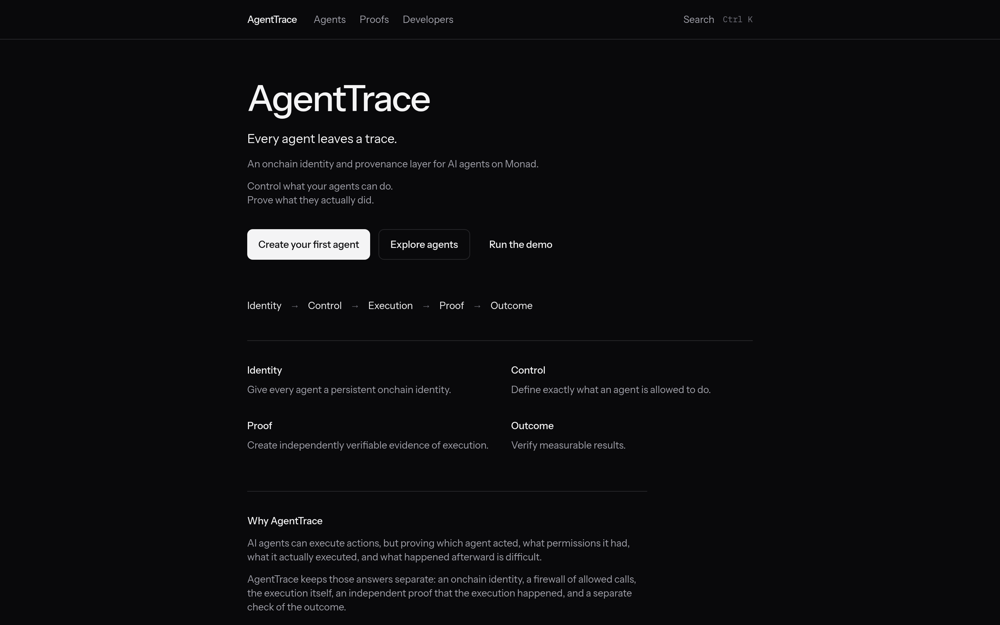
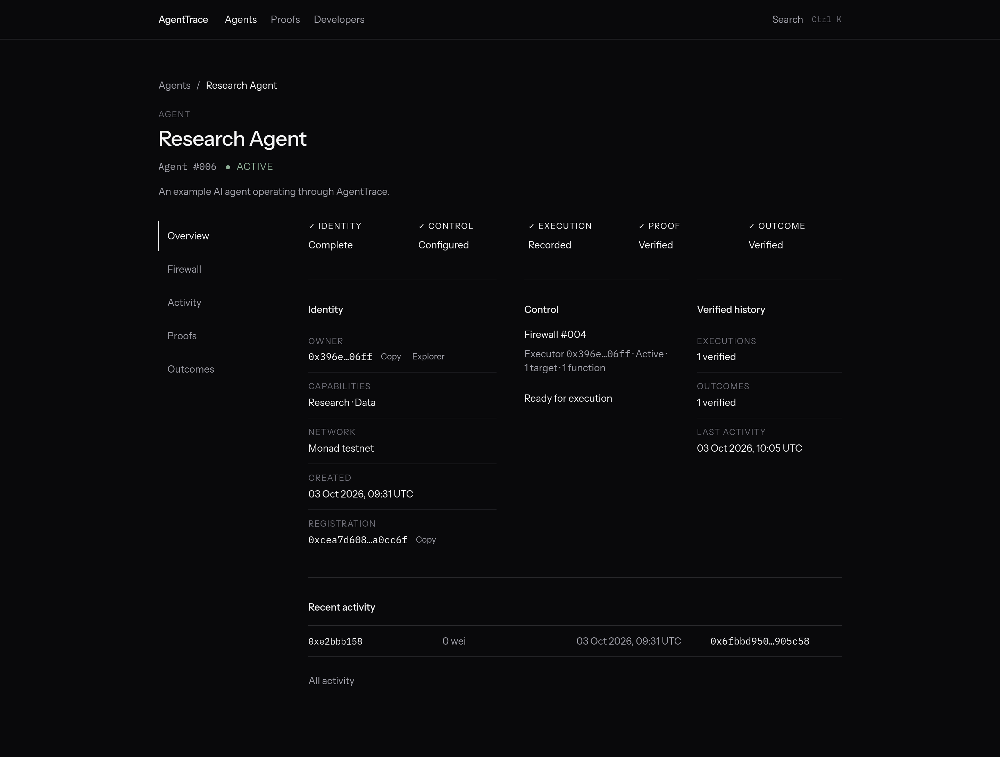
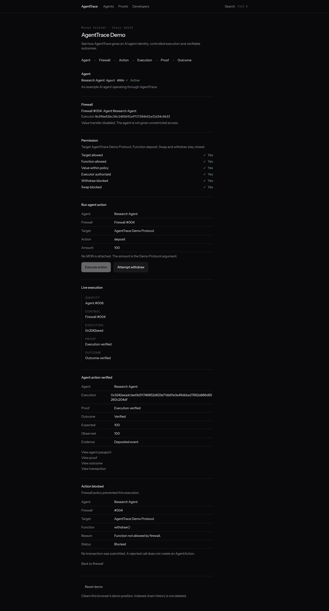
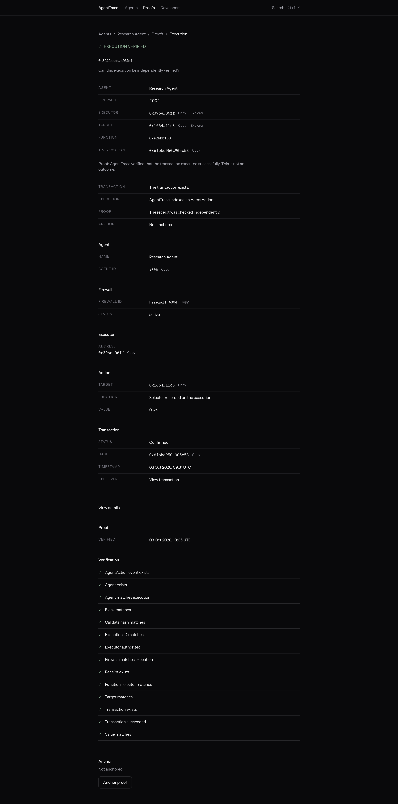
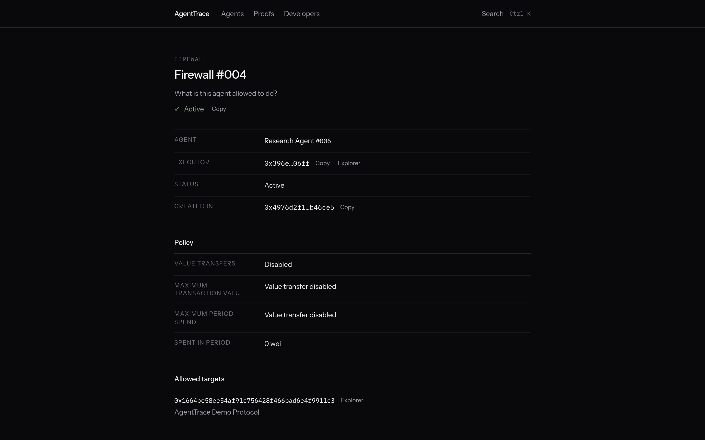
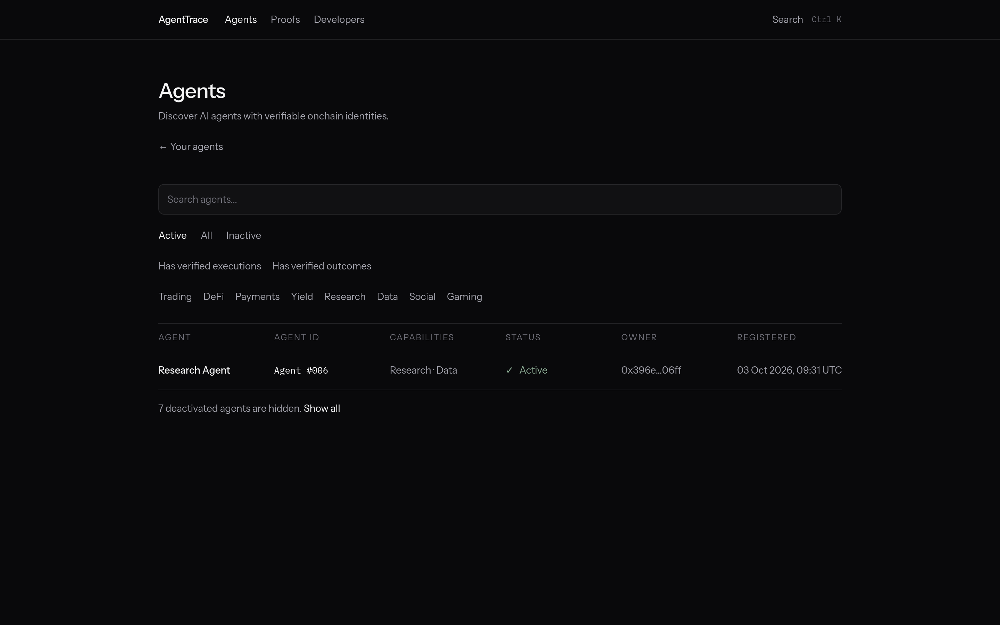

# AgentTrace

Every agent leaves a trace.

An onchain identity and provenance layer for AI agents on Monad.

AI agents need more than wallets. They need identity, controlled permissions, execution provenance, and verifiable outcomes. AgentTrace provides those primitives on Monad testnet.

**Live app:** https://agenttrace-plum.vercel.app · **Demo video:** [docs/demo.mp4](docs/demo.mp4) (82 s, real Monad testnet transactions) · **Submission notes:** [docs/submission.md](docs/submission.md)

## Overview

An agent can call a contract. That does not, by itself, say which agent acted, which permissions were in force, whether the call really happened, or whether the intended result occurred.

## Solution

- **Identity.** `AgentRegistry` assigns a persistent agent id. Deactivation does not reuse the id.
- **Firewall.** `AgentFirewall` is the only path for an approved call. The owner sets the executor, targets, function selectors, and value limits.
- **Execution.** The executor calls `execute`. If the target reverts, the whole transaction reverts. A successful `AgentAction` is emitted only after the target call succeeds.
- **Proof.** An off-chain verifier reads the Monad transaction and receipt. It marks an execution verified only when every critical check matches. It does not trust the browser.
- **Outcome.** A separate check looks for the expected protocol event, or a Demo Protocol balance that this transaction actually changed. A verified execution is not a verified outcome. An unsupported protocol is `unverifiable`, not verified.

## Architecture

```text
Agent
  → AgentRegistry          identity
  → AgentFirewall          permissions and execute()
  → Target contract        the actual call
  → AgentAction event      onchain trace
  → Indexer                chain events into the database
  → Proof verifier         receipt checks and proof hash
  → Outcome verifier       expected event, or unverifiable
```

See [docs/architecture.md](docs/architecture.md) and [docs/security.md](docs/security.md).

## Monad

Monad testnet (chain id 10143) is EVM-compatible. AgentTrace contracts are ordinary Solidity 0.8.31 contracts. The indexer and proof verifier read logs and receipts from the public testnet RPC (`https://testnet-rpc.monad.xyz`). If that endpoint fails or rate-limits, the server falls back to the other public testnet endpoints listed in the Monad docs (`https://rpc-testnet.monadinfra.com`, then `https://rpc.ankr.com/monad_testnet`). Setting `MONAD_TESTNET_RPC_URL` replaces the list with that one endpoint. Permissions are enforced in `AgentFirewall`, not in the client.

Public Monad RPCs limit `eth_getLogs` to 100 blocks per call (see [RPC limits](https://docs.monad.xyz/reference/rpc-limits)). The indexer scans in 100-block windows, a few windows at a time, and saves its cursor after each window. One sync call stops after a short time budget (4 s by default, `MONAD_INDEXER_BUDGET_MS`) and the next request continues from the saved block, so a page never waits on a long catch-up. Registrations, firewall changes, and executions submitted through the app are also confirmed directly from their transaction receipts, so they appear right away even while the history scan is behind.

No throughput or gas figure is claimed here. The deployment record in this repository contains only addresses from confirmed Monad testnet transactions (see Smart contracts below). Environment variables may override it.

## Features

Implemented in this repository:

- Agent registration, update, and deactivation flows against `AgentRegistry`
- Firewall creation, executor, targets, functions, value policy, pause, unpause, and deactivation
- Execution through `AgentFirewall.execute`, with revert of the whole transaction if the target reverts
- Receipt-based proof verification and deterministic proof hashing
- Optional onchain proof anchoring in `AgentProof` when a verifier key is configured
- Outcome verification for an expected event, and for Demo Protocol `deposits` or `swapped` when the onchain value matches
- Indexed agent directory, passport, activity, proofs, and outcomes
- Developer API, hashed API keys, rate limits, and HMAC-signed webhooks
- TypeScript SDK in `sdk/`
- Wallet signing in the browser only when a chain action is submitted
- Google account sign-in for the AgentTrace account, kept separate from the onchain owner, or a wallet-only mode with no accounts

Not implemented:

- Monad mainnet
- A server-side executor that submits firewall transactions for the API
- Upgradeable contracts
- A claim that agents are safe or trustless

## Tech stack

- React 19, TanStack Start, Tailwind CSS
- Solidity 0.8.31, viem, EthereumJS VM for contract tests
- Postgres when `DATABASE_URL` is set, otherwise PGLite
- Optional Vercel Blob cache of indexed chain logs for serverless hosting
- Better Auth for the application account (optional; wallet-only mode turns it off)

## Smart contracts

| Contract | Purpose | Address (Monad testnet, 10143) | Deploy block | Deploy tx |
| --- | --- | --- | --- | --- |
| AgentRegistry | Persistent agent identity | [`0xfa66d202dae4b7fb9aa5c6ee80390ca8bb48739e`](https://testnet.monadvision.com/address/0xfa66d202dae4b7fb9aa5c6ee80390ca8bb48739e) | 67788394 | [`0x3426bbc9…`](https://testnet.monadvision.com/tx/0x3426bbc9643ea6f04e278d109645d036aa85a9e3d485cd9f6cc3bbd98fc2dfff) |
| AgentFirewall | Permissions and execution | [`0x694178a2396b54bff6a25caa0aa9cca6eb079441`](https://testnet.monadvision.com/address/0x694178a2396b54bff6a25caa0aa9cca6eb079441) | 67788397 | [`0x9346cf54…`](https://testnet.monadvision.com/tx/0x9346cf54288f0cd0683e0c92a1e0ce50727d84409eb51a2a2bcb072a6f282044) |
| AgentProof | Immutable proof-hash anchors | [`0x3ea5602072d6028f569f45ea164d5cbe36cbbd3e`](https://testnet.monadvision.com/address/0x3ea5602072d6028f569f45ea164d5cbe36cbbd3e) | 67788400 | [`0x4e017247…`](https://testnet.monadvision.com/tx/0x4e0172478ce7dde026c13d6c020cd5788e4ba64a9cf42d38554c02643b2d95b4) |
| DemoProtocol | Deposit, swap, and withdraw demo target | [`0x1664be58ee54af91c756428f466bad6e4f9911c3`](https://testnet.monadvision.com/address/0x1664be58ee54af91c756428f466bad6e4f9911c3) | 67788404 | [`0xd9f5fad6…`](https://testnet.monadvision.com/tx/0xd9f5fad6e0043f9980e084643ea60dc47c6572139072de9f6ded64c20f38bdae) |

Deployed on 3 October 2026 by `0x4f3f999B60750cEf97D7D56c75f30F050A583D53` with `npm run deploy:testnet`. `AgentFirewall.agentRegistry()` returns the registry above. The AgentProof verifier is the deployer address; the owner can change it with `setVerifier`. Addresses stay null until a confirmed transaction exists. Environment variables may override the record. See [docs/contracts.md](docs/contracts.md).

## Deploying the contracts to Monad testnet

One command deploys all four contracts in order (registry, firewall with the registry address, proof anchor, demo protocol) and writes every confirmed address, block, and transaction hash to `src/lib/chain/deployment.ts`:

```bash
MONAD_DEPLOYER_PRIVATE_KEY=0x... npm run deploy:testnet
git add src/lib/chain/deployment.ts && git commit -m "Record Monad testnet deployment"
```

- The deployer needs testnet MON from [faucet.monad.xyz](https://faucet.monad.xyz). The four deployments use about 3.1M gas; at the 102 gwei testnet gas price seen on 2 Oct 2026 that is about 0.4 MON with the script's 20% margin. The script checks the balance first and sends nothing if it is too low.
- It refuses any chain other than 10143.
- A contract already in the record (with bytecode on chain) is skipped, so a failed run can be re-run.
- The AgentProof verifier is the address of `AGENT_PROOF_VERIFIER_PRIVATE_KEY` when set, else `AGENT_PROOF_VERIFIER_ADDRESS`, else the deployer. The owner can change it later with `setVerifier`.
- The private key is read from the environment only. Do not commit it or put it in a hosted app's environment.

Committing the record means every build uses the addresses without extra environment variables.

## Local development

Requires Node.js 22.12 or newer (TanStack Start). `.nvmrc` pins 22.

```bash
npm install
npm run dev
```

The dev server listens on port 8080.

## Hosting on Vercel

The app builds with the Nitro `vercel` preset (`npm run build` writes `.vercel/output`). The hosted deployment runs in **wallet-only mode**:

- `VITE_AUTH_ENABLED=false`. There are no application accounts and no sign-in. Identity is the connected wallet: agents and firewalls belong to whoever owns them onchain, and every chain action is signed by that wallet. The `/firewalls/new` page lists agents the connected wallet owns onchain. Account settings, API keys, and webhooks are hidden, because they need a persistent account database.
- No `DATABASE_URL`. Each serverless instance uses its own in-memory PGLite database. Do not set `DATABASE_URL` with auth off: the server refuses that combination on purpose, so account data is never shared under a fallback identity.
- Chain data is the source of truth. Every instance rebuilds its view from Monad logs. To avoid rescanning from the deploy block on every cold start, set `BLOB_READ_WRITE_TOKEN` (connect a private Vercel Blob store to the project). The indexer then keeps the raw logs it has seen and the last scanned block in one private blob (`agenttrace/chain-cache-10143.json`, keyed by contract address and deploy block) and replays them into a fresh instance. The cache holds only public chain data. Without the token, the indexer still works and simply scans from the deploy block.
- Outcome checks are kept in the same blob as requests only (execution id and expectation); a fresh instance re-runs them against Monad. Verdicts are never copied.
- A transaction submitted through the app is confirmed from its own receipt. If that request lands on a different instance than the one that recorded the intent, the browser resubmits the intent from the transaction hash, so the confirmation does not depend on which instance answers.
- Node.js 22.x.

```bash
vercel link --scope <team>
vercel env add VITE_AUTH_ENABLED production   # value: false
vercel blob create-store agenttrace-chain-cache --access private   # optional cache
vercel deploy --prod
```

With the GitHub repository connected to the Vercel project, every push to `main` redeploys. Contract addresses come from the committed `src/lib/chain/deployment.ts`, so no address variables are needed once the deployment is recorded.

## Environment variables

Copy [.env.example](.env.example). Do not commit filled secrets.

Public chain constants live in `src/lib/chain/network.ts`. Server-only values, including any verifier key, stay in the server environment.

## Running the application

```bash
npm run dev
npm run typecheck
npm run build
```

## Testing

```bash
npm test                # app unit tests, auth tests, indexer log-window tests
npm run test:contracts  # registry, firewall, proof, demo, developer, reputation in a local EVM
npm run test:workspace  # Grok App Builder workspace template tests (see note)
```

`npm test` runs the app unit and auth tests and checks that the indexer never asks the RPC for more than 100 blocks, applies logs in order, and resumes from its saved cursor. `npm run test:contracts` loads the contracts in a local EVM and checks registry, firewall, proof, demo, developer, and reputation behavior; the registry test also checks that a public Monad testnet endpoint answers with chain id 10143. These do not replace a live Monad testnet deployment.

`npm run test:workspace` runs the Grok App Builder template tests that came with the project scaffold. Some of them read workspace files that are not in this repository (`.grok/`, `AGENTS.md`) or expect the untouched template, so they fail in a fresh clone. They do not test AgentTrace behavior.

### End-to-end check on a local Monad testnet fork

This runs the real contracts, indexer, and proof verifier against a fork of Monad testnet without spending testnet MON. It needs [Foundry](https://book.getfoundry.sh/) for `anvil` and `cast`.

```bash
anvil --fork-url https://rpc-testnet.monadinfra.com --chain-id 10143 --port 8545
# anvil's public dev key #0 is pre-funded on the fork only
MONAD_DEPLOYER_PRIVATE_KEY=0xac0974bec39a17e36ba4a6b4d238ff944bacb478cbed5efcae784d7bf4f2ff80 \
  MONAD_DEPLOY_RPC_URL=http://127.0.0.1:8545 npm run deploy:testnet
MONAD_TESTNET_RPC_URL=http://127.0.0.1:8545 npm run dev
```

Then register an agent, create a firewall, allow `DemoProtocol.deposit`, and call `execute` from the executor (with `cast send`, or a wallet pointed at `http://127.0.0.1:8545`). `/agents`, `/firewalls/1`, `/proofs`, and `POST /api/proofs/<executionId>/verify` then show the indexed agent, the execution, and a `receipt_verified` proof. Restore `src/lib/chain/deployment.ts` afterwards (`git checkout src/lib/chain/deployment.ts`) so fork addresses are never committed.

## Demo

`/demo` walks through identity, firewall, an allowed deposit, proof verification, outcome verification, and a blocked withdraw. It uses the configured Monad testnet contracts and the connected wallet. If those contracts are not deployed, the page says so and does not invent a result. If the RPC cannot be reached, it says the testnet connection is unavailable and offers retry.

Script: [docs/demo-script.md](docs/demo-script.md). Recording: [docs/demo.mp4](docs/demo.mp4), made against the live app with real testnet transactions (agent #008, firewall #006, deposit [0x19b05db4…](https://testnet.monadvision.com/tx/0x19b05db42e4c2ea0885b0d3f8aa7fa4948a5507d9e3051feadf4067da4db78cd)).


## Screenshots

From the live deployment on Monad testnet. Agent #006 is a complete example: identity, firewall, allowed deposit, verified proof, and verified outcome.

| | |
| --- | --- |
|  |  |
| Landing | Agent passport (#006) |
|  |  |
| `/demo` after a live run: deposit verified, withdraw blocked | Execution proof with every receipt check |
|  |  |
| Firewall #004 policy | Agents list (deactivated test agents hidden) |

## Security

- The firewall owner authorizes the executor, targets, selectors, and value limits.
- `execute` checks agent activity, firewall activity, pause, executor, target, selector, calldata length, and value policy before the call.
- State written before the external call is rolled back if the target reverts, including nonce and spend.
- The proof verifier recomputes checks from the transaction, receipt, and `AgentAction` log. Any failed critical check yields `unverifiable` and no proof hash.
- Proof hash bytes are `abi.encode` of a fixed field list. See [docs/contracts.md](docs/contracts.md).
- API keys are stored as SHA-256 hashes. The full secret is returned once.
- Webhook bodies are HMAC-SHA256, header `X-AgentTrace-Signature: sha256=<hex>`.
- The API does not accept an API key in the query string and does not send a firewall transaction on the caller’s behalf.

## Roadmap

- Deploy the four contracts to Monad testnet (`npm run deploy:testnet`) and commit the confirmed addresses
- Configure the proof-anchor verifier
- Let a configured executor submit `execute` from the API without weakening firewall checks

## Documentation

- [Architecture](docs/architecture.md)
- [Contracts](docs/contracts.md)
- [API](docs/api.md)
- [SDK](docs/sdk.md)
- [Demo script](docs/demo-script.md)
- [Submission notes](docs/submission.md)

## License

MIT. See [LICENSE](LICENSE). The SDK uses the same license.
