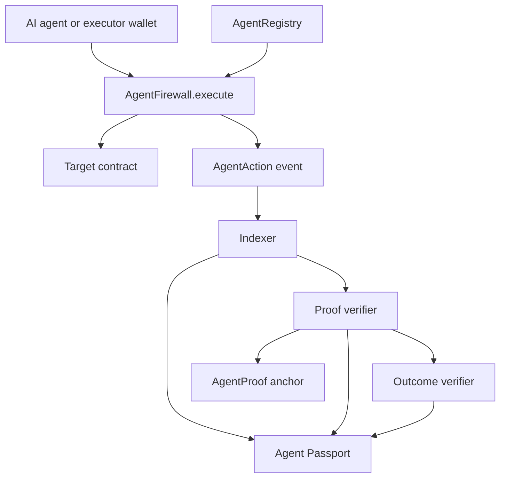

# Architecture

AgentTrace separates identity, permission, execution, proof, and outcome. A fact shown in the product comes from one of those sources, not from a value typed in the browser.

## Agent identity

`AgentRegistry.registerAgent` assigns the next id and emits `AgentRegistered`. The owner address on that event is the blockchain owner. A Google account in AgentTrace is only the application login. It is not written as the agent owner.

Deactivation emits `AgentDeactivated` and leaves the id unused. The contract has no admin function that rewrites history.

## Firewall

`AgentFirewall` is constructed with the registry address. `createFirewall` records the executor and a value policy. The owner may later change the executor, targets, selectors, limits, pause state, or active state.

`execute` is the only call path:

1. The firewall and the agent must be active, and the firewall must not be paused.
2. `msg.sender` must be the configured executor.
3. The target and the 4-byte selector must be allowed.
4. `msg.value` must equal the declared value.
5. A non-zero value must fit the per-transaction and per-period limits.
6. The target is called. If it reverts, the firewall reverts with it.
7. `AgentAction` is emitted only after that call succeeds.

The execution id is `keccak256(abi.encode(firewallId, agentId, executor, nonce, target, selector))`. The nonce is written before the external call so a reentrant `execute` cannot reuse it. If the target reverts, the whole transaction reverts, so the nonce and the period spend do not persist. `AgentAction` is not emitted for a revert.

## Events and indexer

The indexer reads logs from the configured registry and firewall addresses on chain 10143. Public Monad RPCs accept at most 100 blocks per `eth_getLogs` call, so the indexer scans in 100-block windows and saves its cursor after each one. A sync call has a short time budget; the next call resumes from the cursor. It stores chain id, contract address, transaction hash, block number, and log index. Reprocessing the same log does not create a second row. If a contract address is unset, the indexer reports that the contract is not deployed and does not invent agents or executions.

On serverless hosts each instance starts with an empty in-memory database. When `BLOB_READ_WRITE_TOKEN` is set, the indexer also keeps the raw logs it has applied and the last scanned block in one private Vercel Blob object, keyed by contract address and deploy block. A new instance replays those logs through the same handlers and continues from the cached block. The cache contains only public chain data; deleting it only costs a rescan. Executions replayed this way are queued for receipt verification again, so proof state is recomputed from chain data rather than copied.

Derived rows can be rebuilt by scanning those logs again.

## Proof verification

`assessExecution` does not trust a status sent by the client. It requires the transaction, a successful receipt, and an `AgentAction` log on the configured firewall address. It then checks agent id, firewall id, executor, target, selector, execution id, block, value, and calldata hash. If any required check fails, the status is `unverifiable` and no proof hash is stored.

A temporary RPC failure is `temporary_error`, not a failed proof and not a verified proof.

The proof hash is documented in [contracts.md](contracts.md). Anchoring sends that hash to `AgentProof` only when the verifier key and proof contract are configured. A mismatch does not get anchored.

## Outcome verification

Outcome checks are separate from execution proof. `EVENT_EMITTED` reads the target logs. `VALUE_CHANGED`, `BALANCE_CHANGED`, and `STATE_CHANGED` are verified only for Demo Protocol `deposits` or `swapped`, and only when this transaction emitted a matching event and the onchain value equals the expected value. Anything else is rejected or `unverifiable`. It is not marked verified. An expected event on the Demo Protocol is decoded with the real ABI, including indexed parameters such as `agentId`. For other targets the first indexed layout of the given signature that decodes the log is used, and the outcome is verified only when the decoded arguments match the expected ones.

## API and SDK

`/api/v1` authenticates with `Authorization: Bearer`. Keys are SHA-256 hashed at rest. Reads of indexed data can be anonymous, within a rate limit. Writes that would change chain state do not submit a transaction from the server. They either confirm a transaction hash the caller already sent, or they refuse with `CHAIN_WRITE_UNAVAILABLE` and a null hash.

The SDK in `sdk/` is a typed client for those routes. See [sdk.md](sdk.md) and [api.md](api.md).
